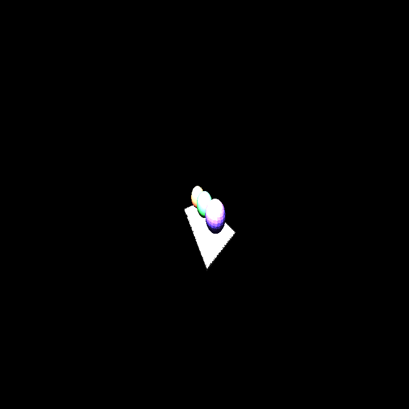
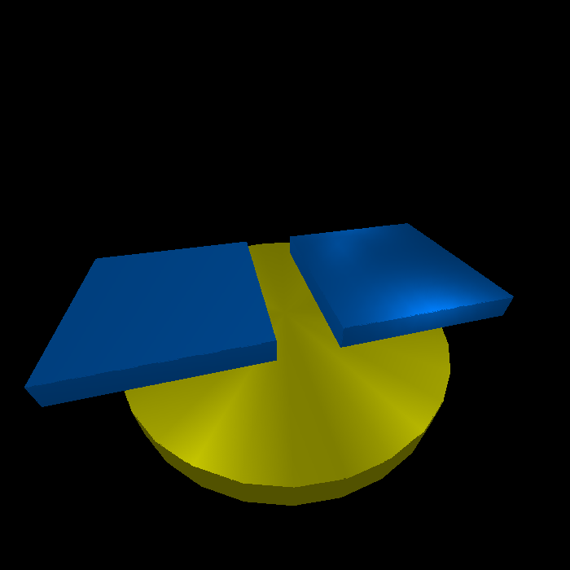
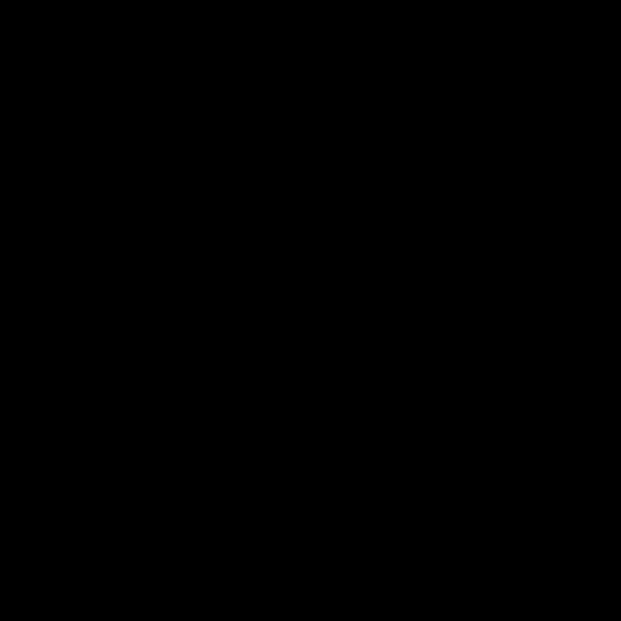

# Example Scenes and Generated Images

This directory contains example XML scene files and their corresponding rendered images that demonstrate various shading techniques and common issues.

## Available Examples

### `best_practices.xml` / `best_practices.png`
**Purpose**: Demonstrates all four shading techniques side by side with optimal lighting and camera setup.



**Contains**: 
- Three spheres showing Phong, Gouraud, and Constant shading
- Proper lighting setup with primary and fill lights
- Ground plane with adequate tessellation

**Key points**: 
- Shows clear differences between shading methods
- Demonstrates proper specular highlights with Phong shading
- Good example of professional scene setup

### `simple_example.xml` / `simple_example.png`
**Purpose**: Simplified version of the main scene focusing on tessellation effects.



**Contains**:
- Two blocks with different tessellation levels (low vs high)
- Demonstrates the "one-colored" issue with low tessellation
- Shows how higher tessellation improves gradient quality

**Key points**:
- Low tessellation: dl="1" dw="1" dh="1" produces flat appearance
- High tessellation: dl="10" dw="10" dh="1" shows smooth gradients
- Direct illustration of the reported shading issue

### `plane_tessellation.xml` / `plane_tessellation.png`
**Purpose**: Focused comparison of tessellation effects on flat surfaces.



**Contains**:
- Two identical planes with different subdivision levels
- Demonstrates before/after tessellation improvement

**Note**: This scene has clipping issues with the current camera setup but illustrates the concept.

### `shading_comparison.xml`
**Purpose**: Side-by-side comparison of three spheres with different shading methods.

**Contains**:
- Phong shaded sphere (left, red)
- Gouraud shaded sphere (center, green)  
- Constant shaded sphere (right, blue)

**Note**: This scene has performance issues with complex clipping operations and may not render successfully. Use `best_practices.xml` instead for a working demonstration of different shading techniques.

## Usage

Generate any example image:
```bash
java -jar shader.jar examples/[scene_name].xml examples/[output_name].bmp
```

**Note**: PNG versions are provided in the repository for showcase purposes. You can generate BMP files locally using the command above.

## Visual Differences Explained

### Wireframe (WIRE)
- Only triangle edges are visible
- No surface filling or shading
- Fastest rendering method
- Useful for debugging geometry

### Constant Shading (CONST)
- Each triangle has uniform color
- Faceted, angular appearance
- Clear triangle boundaries visible
- Simple lighting calculation per triangle

### Gouraud Shading (GOUARD)
- Smooth color transitions across surfaces
- Colors calculated at vertices, interpolated across triangles
- Quality depends heavily on tessellation (subdivision) level
- Good balance of quality and performance

### Phong Shading (PHONG)
- Per-pixel lighting calculations
- Smoothest gradients and most realistic specular highlights
- Independent of tessellation for surface smoothness
- Highest computational cost

## Common Issues and Solutions

### Issue: "One-colored" or flat appearance
**Cause**: Insufficient tessellation (subdivision) for Gouraud shading
**Solution**: Increase dl, dw, dh parameters in object definitions

### Issue: Too dark or no visible lighting
**Cause**: Improper camera positioning or inadequate lighting
**Solution**: Use proven camera setups from working examples

### Issue: Excessive specular highlights  
**Cause**: Too high specular coefficients or shininess values
**Solution**: Reduce specS values or adjust specular color components

## Technical Notes

- All images are 700x700 pixels
- PNG versions are provided for showcase, BMP versions can be generated locally
- Lighting calculations fixed to prevent negative color values
- Camera setup is crucial for proper visibility of geometry
- Point light attenuation follows: 1/(attX + attY*d + attZ*d²)

## Best Practices

1. **Start with working examples** and modify incrementally
2. **Use adequate tessellation** for smooth Gouraud shading (dl, dw, dh ≥ 8)
3. **Position lights strategically** to create good contrast and gradients
4. **Test different shading methods** to find the best visual quality for your scene
5. **Balance ambient and point lighting** for realistic results