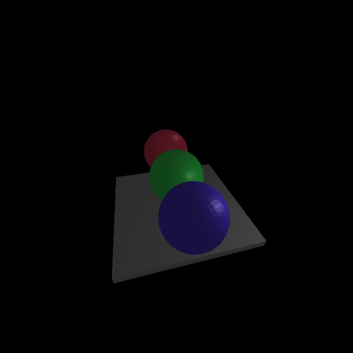

# Example Scenes and Generated Images

This directory contains example XML scene files and their corresponding rendered images that demonstrate various shading techniques and common issues.

## Available Examples

### `best_practices.xml` / `best_practices.png`
**Purpose**: Demonstrates all four shading techniques side by side with optimal lighting and camera setup.


**Contains**: 
- Three spheres showing Phong, Gouraud, and Constant shading
- Properly balanced lighting with primary and fill lights
- Ground plane with adequate tessellation
- Optimized camera positioning for clear visibility

**Key points**: 
- Shows clear differences between shading methods with proper brightness levels
- Demonstrates realistic specular highlights with Phong shading
- Professional scene setup with balanced lighting to avoid overexposure
- Camera positioned at optimal angle and distance for showcasing all spheres

### `simple_example.xml` / `simple_example.png`
**Purpose**: Colorful castle scene demonstrating various shading techniques in an engaging architectural context.


**Contains**:
- Castle main body (gray stone block with Gouraud shading)
- Multiple colored towers using different shading methods
- Red tower (left) with Phong shading for realistic highlights
- Blue tower (right) with Phong shading
- Green central tower with Gouraud shading
- Dark gate entrance with constant shading
- Colorful grass ground plane

**Key points**:
- Demonstrates how different shading techniques work on architectural elements
- Shows realistic material properties with varied colors and reflectance
- Multiple light sources create natural lighting conditions
- Good example of mixing shading techniques for different materials

### `plane_tessellation.xml` / `plane_tessellation.png`
**Purpose**: Focused comparison of tessellation effects on flat surfaces.


**Contains**:
- Two identical planes with different subdivision levels (left: low tessellation, right: high tessellation)
- Multiple light sources for even illumination
- Clear demonstration of how tessellation affects gradient quality
- Base platform for spatial reference

**Key points**:
- Left plane (dl="1" dw="1"): Shows flat, "one-colored" appearance with insufficient tessellation
- Right plane (dl="10" dw="10"): Demonstrates smooth gradients with proper tessellation
- Fixed camera positioning and bright lighting for clear visibility
- Direct illustration of the tessellation-related shading issue and its solution

### `shading_comparison.xml` / `shading_comparison.png`
**Purpose**: Side-by-side comparison of three spheres with different shading methods.



**Contains**:
- Phong shaded sphere (left, red) - smoothest highlights
- Gouraud shaded sphere (center, green) - smooth color transitions  
- Constant shaded sphere (right, blue) - faceted appearance
- Ground plane for spatial reference

**Key points**:
- Clear visual demonstration of how each shading technique affects surface appearance
- Same sphere geometry with different rendering methods
- Balanced lighting to show realistic material properties
- Illustrates the progression from faceted to smooth shading

## Usage

Generate any example image:
```bash
java -jar shader.jar examples/[scene_name].xml examples/[output_name].bmp
```

**Note**: PNG versions are provided in the repository for showcase purposes. You can generate BMP files locally using the command above.

## Visual Differences Explained

### Wireframe (WIRE)
- Only triangle edges are visible
- No surface filling or shading
- Fastest rendering method
- Useful for debugging geometry

### Constant Shading (CONST)
- Each triangle has uniform color
- Faceted, angular appearance
- Clear triangle boundaries visible
- Simple lighting calculation per triangle

### Gouraud Shading (GOUARD)
- Smooth color transitions across surfaces
- Colors calculated at vertices, interpolated across triangles
- Quality depends heavily on tessellation (subdivision) level
- Good balance of quality and performance

### Phong Shading (PHONG)
- Per-pixel lighting calculations
- Smoothest gradients and most realistic specular highlights
- Independent of tessellation for surface smoothness
- Highest computational cost

## Common Issues and Solutions

### Issue: "One-colored" or flat appearance
**Cause**: Insufficient tessellation (subdivision) for Gouraud shading
**Solution**: Increase dl, dw, dh parameters in object definitions (recommend ≥ 8-10 for smooth gradients)

### Issue: Scene renders completely black
**Cause**: Improper camera positioning, objects outside viewing frustum, or insufficient lighting
**Solution**: Use proven camera setups from working examples; ensure adequate ambient + point lighting

### Issue: Too dark or no visible lighting
**Cause**: Light sources too far from objects or insufficient light intensity
**Solution**: Position lights closer to objects; increase light intensity (s parameter); add ambient lighting

### Issue: Overexposed or too bright objects
**Cause**: Excessive light intensity or too many overlapping light sources
**Solution**: Reduce point light intensity (s parameter); decrease ambient lighting; balance multiple light sources

## Technical Notes

- All images are 700x700 pixels
- PNG versions are provided for showcase, BMP versions can be generated locally
- Lighting calculations fixed to prevent negative color values
- Camera setup is crucial for proper visibility of geometry
- Point light attenuation follows: 1/(attX + attY*d + attZ*d²)

## Best Practices

1. **Start with working examples** and modify incrementally
2. **Use adequate tessellation** for smooth Gouraud shading (dl, dw, dh ≥ 8)
3. **Position lights strategically** to create good contrast and gradients
4. **Test different shading methods** to find the best visual quality for your scene
5. **Balance ambient and point lighting** for realistic results